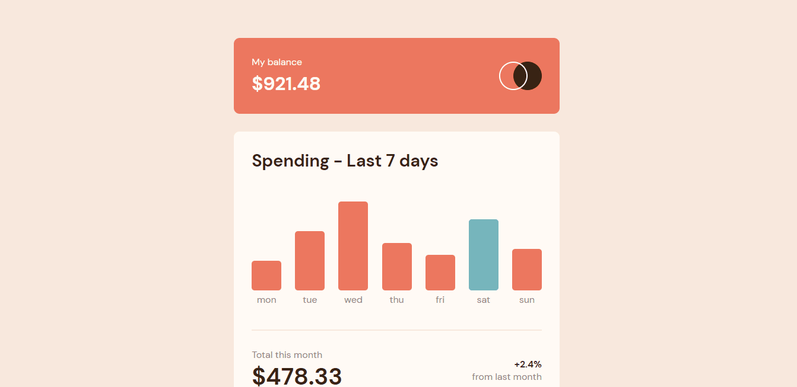
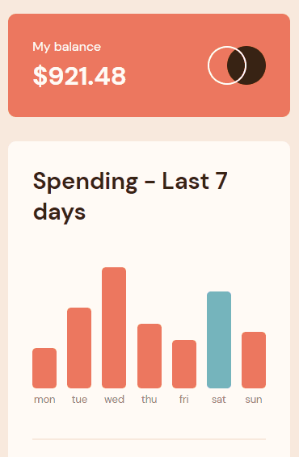

# Desafio Gerenciador de Despesas - Frontend-Mentor

Este é um desafio de um gerenciador de despesas, proposto pelo site Frontend-Mentor.

## Tabela de Conteúdos

- [Visão Geral](#visão-geral)
    - [Imagens](#imagens)
    - [Link da página](#link)
- [Processo](#processo)
    - [Linguagens utilizadas](#linguagens-utilizadas)
    - [O que aprendi](#o-que-aprendi)
    - [Possíveis evoluções](#possíveis-evoluções)
- [Autor](#autor)

## Visão-geral

### Imagens

<br>

````
Versão de Desktop
````

   

<br>

````
Versão Mobile

````

 

### Link

- Página no GitHub Pages: <a href="https://julio-mansan2.github.io/gerenciador-de-despesas/">Clique aqui!</a>

## Processo

### Linguagens utilizadas

<br>

- Marcações semânticas de HTML5
- Propriedades de customização do CSS3
- Estruturas de JavaScript

<br>

### O que aprendi

<br>

- Utilizar datas no JavaScript:

````javascript

const date = new Date();
const weekDay = date.getDay();

````

- Aplicar estilos a elementos:

````javascript

if (weekDay === 0) {
        graphic[6].style.background = 'hsl(186, 34%, 60%)'
        graphic[0].style.background = 'hsl(10, 79%, 65%)'
        graphic[1].style.background = 'hsl(10, 79%, 65%)'
        graphic[2].style.background = 'hsl(10, 79%, 65%)'
        graphic[3].style.background = 'hsl(10, 79%, 65%)'
        graphic[4].style.background = 'hsl(10, 79%, 65%)'
        graphic[5].style.background = 'hsl(10, 79%, 65%)'
    }

````
<br>

### Possíveis evoluções

<br>

- Códigos mais compactos;
- Evitar o resize de certos elementos.

<br>

## Autor

GitHub - <a href="https://github.com/julio-mansan2">julio-mansan2</a> <br>
Front-end Mentor - <a href="https://www.frontendmentor.io/profile/julio-mansan2">julio-mansan2</a> <br>
LinkedIn - <a href="https://www.linkedin.com/in/j%C3%BAlio-a-mansan-3415a7249/">Júlio A.</a> <br>